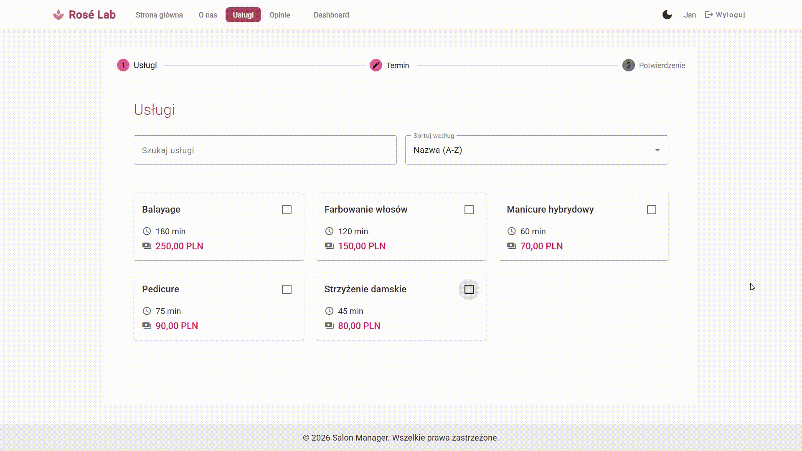
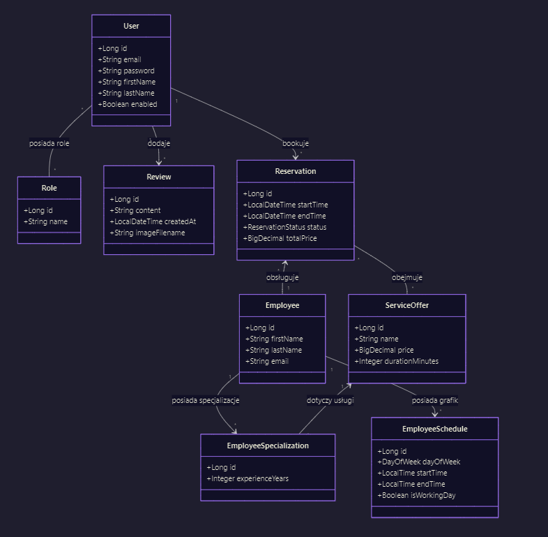
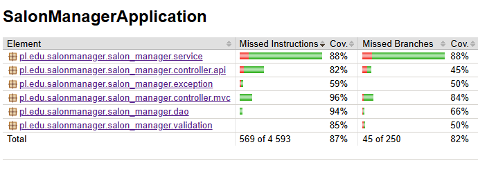

# Salon Manager - Appointment and Management System

A comprehensive SaaS-style web application designed for service-based businesses (hairdressers, beauty salons). The system goes beyond simple appointment booking, serving as a business command center—from employee schedule management to financial analytics.

## Key Features

### Intelligent Booking Algorithm
* **User-Driven Selection:** Clients select multiple services for a single visit.
* **Duration Calculation:** The algorithm aggregates the total duration and converts it into 15-minute time slots.
* **Specialization Filtering:** Filters staff members based on the required skill set for the entire service package.
* **Time-Slot Optimization:** Scans employee schedules for sufficiently large availability windows.
* **Real-Time Availability:** Displays valid time slots for the user to choose from.

### Analytics Module
* **Financial Insights:** Calculation of the average transaction value per client.
* **Service Efficiency:** Analysis of average service durations.
* **High Performance:** Utilizes Group By and RowMapper for maximum efficiency when processing large datasets via direct SQL.

### Client Dashboard
* **Appointment History:** Overview of completed and canceled bookings with advanced filtering and sorting.
* **Account Management:** Profile data editing using Reactive Forms with robust field validation.
* **Flexible Modifications:** Ability to edit or cancel bookings before salon confirmation.
* **Reviews System:** Leave feedback for the salon, add photos to reviews, and manage your own posts.

### Admin Panel
* **Staff Management:** Full CRUD module for employees with detailed configuration forms.
* **User Control:** Monitor account statuses (Active/Suspended) and track user-specific statistics.
* **Booking Overview:** A centralized system for managing all salon appointments.




---

## Project Architecture

* **frontend/** - Client-side application (Angular), served in production via Nginx on port 80.
* **backend/** - RESTful API server (Spring Boot, Java 21) listening on port 8080.
* **postgres** - Relational database listening on port 5432.

---

## Technical Stack

### Backend: Spring Boot 3 (Java 21)
* **Data Access Layer:**
    * **Spring Data JPA:** Handles complex relationships (@ManyToOne, @ManyToMany) and custom queries with pagination (Pageable).
    * **JdbcTemplate & SQL:** Dedicated analytics module using raw SQL queries with GROUP BY and custom RowMapper implementations for business KPIs.
* **Logic & Security:**
    * **Spring Security:** Role-based access control (RBAC), BCrypt password hashing, and REST endpoint protection.
    * **State Machine:** Manages the reservation lifecycle (CREATED -> CONFIRMED -> APPROVED -> CANCELLED) with strict edit-lock logic.
    * **Integrity:** Strategic use of @Transactional to ensure consistency during multi-service booking processes.
* **Communication & View Layer:**
    * **REST API & Swagger:** Full OpenAPI documentation available at /swagger-ui.html.
    * **Hybrid Rendering:** Utilizes Thymeleaf for SEO-friendly public sections (pricing, reviews) and Angular for high-interactivity user panels.
    * **Global Error Handling:** Centralized @RestControllerAdvice for consistent API error responses.

### Frontend: Angular (v17+)
* **State Management:** Reactive architecture powered by Services + RxJS.
* **UI/UX:** Angular Material library, Dark/Light Mode support, and full responsiveness.
* **Advanced Forms:** Multi-step booking wizard (Material Stepper) with custom cross-field validators.
* **Security & Flow:** Implementation of Guards (route protection) and Interceptors (automatic auth header attachment and global error catching).

### Code Quality & DevOps
* **Testing (JUnit 5 & Mockito):** Code coverage at 80% (JaCoCo). Suite includes repository tests (@DataJpaTest), controller tests (@WebMvcTest), and full integration scenarios (@SpringBootTest).
* **Containerization:** Full environment orchestration using Docker Compose (Spring Boot, PostgreSQL, Nginx).

---

## Data Model
* **User & Role** – Authentication and authorization system.
* **Employee & ServiceOffer** – Staff and service catalog management (specialization mapping).
* **Reservation** – The central entity connecting the client, staff, and selected services.
* **Review** – Feedback system to build social proof in the public zone.



---

## Installation and Demo

Navigate to the salon-manager root directory (where docker-compose.yml is located) and run:

```bash
docker compose up -d --build

**Access points:**
* Frontend: http://localhost
* API Backend Swagger documentation: http://localhost:8080/swagger-ui/index.html
* Database: `localhost:5432`

**Login (Test data):**
* Admin: admin@salon.pl / admin123
* Client: user@example.com / haslo123

**Run backend tests:**

```bash
./mvnw clean test
```
